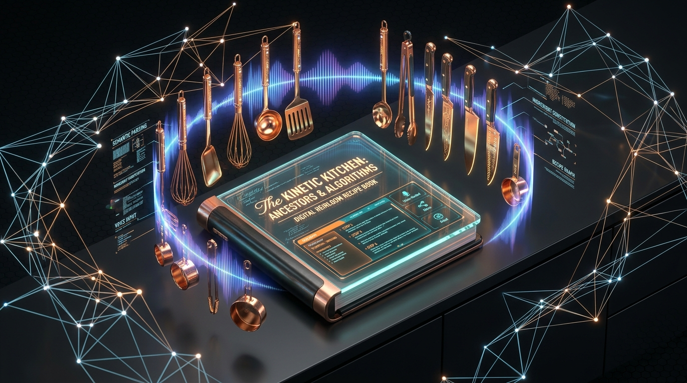
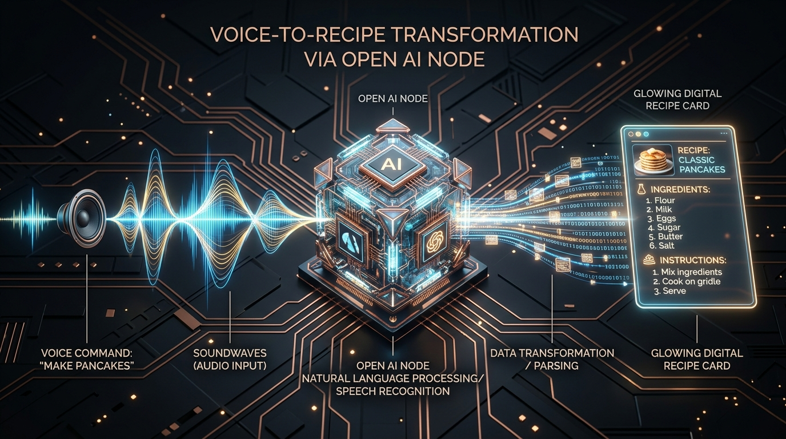
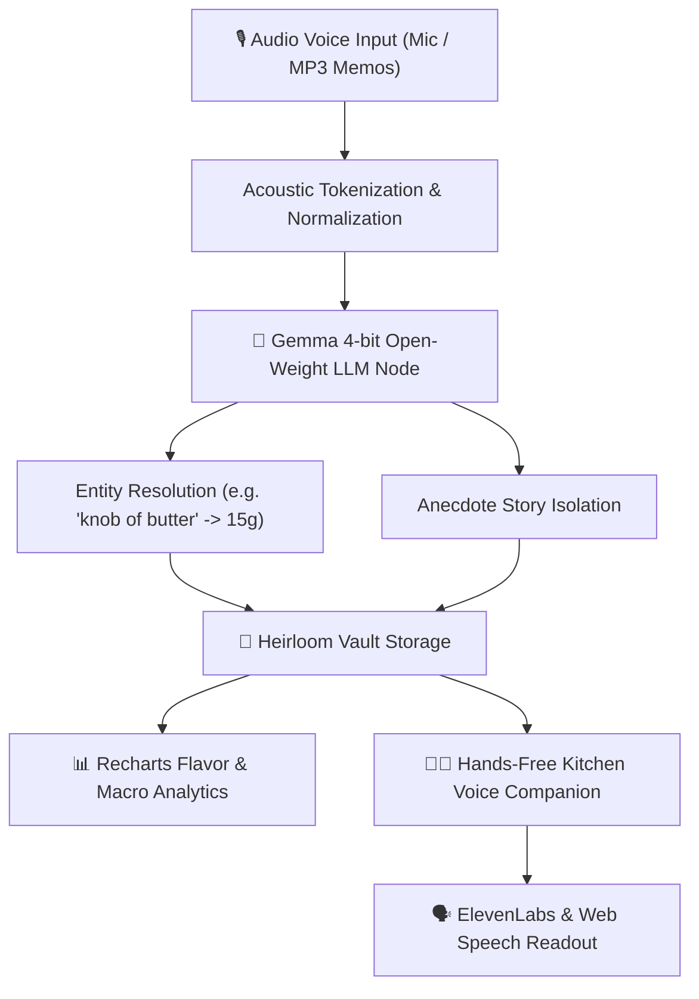

<div align="center">

# 🍳 Heirloom AI
### *Grandpa's Voice Recipe Vault & Hands-Free Kitchen Companion*

[](https://heirloom-ai-pi.vercel.app/)
[](https://github.com/vannu07/Heirloom-AI)
[](https://dev.to/challenges/hacktoberfest-weekend-2026-10-01)
[](https://ai.google.dev/gemma)

<br />



<p align="center">
  <b>Built for the Hacktoberfest Weekend Challenge: Build for a Friend</b><br />
  Preserving priceless family culinary knowledge using open-weight Gemma AI & ElevenLabs Voice Synthesis.
</p>

</div>

---

## 🌟 Executive Summary

**Heirloom AI** is built for Grandpa Arthur (and families with elderly loved ones). Grandpa Arthur spent a lifetime mastering rustic Italian dishes, slow-simmered marinara, and secret family recipes. As he got older, writing or typing recipes down became difficult, so he began recording rambling voice memos on his phone.

However, voice notes are unstructured, contain rambling family anecdotes, and lack exact measurements (*"a pinch of love"*, *"a knob of butter"*). 

**Heirloom AI** uses open-weight **Gemma AI** to process Grandpa's voice audio, resolve vague measurements into standardized quantities, separate emotional stories from technical cooking steps, and store them in an interactive Heirloom Vault.

It also features a **Hands-Free Kitchen Companion** with voice commands (*"Next step"*, *"Repeat"*) and natural voice audio readout so anyone in the kitchen can cook Grandpa's recipes hands-free without getting screens greasy!

---

## 📸 3D Architecture & Transformation Pipeline



### End-to-End System Pipeline



---

## 🚀 Key Features

### 🎙️ 1. Voice Memory Studio
- **Acoustic Waveform Canvas**: Real-time microphone audio recording visualization using HTML5 Canvas API.
- **Voice Persona Selector**: Toggle between *Grandpa Arthur*, *Grandma Rose*, and *Uncle Marco*.
- **Gemma 4-bit Extraction Engine**: 3-step live entity resolution visualizer translating informal cooking terms into metric/US quantities.

### 📖 2. The Heirloom Vault
- **Editorial Archive Gallery**: Filter by dietary tags (*Gluten-Free*, *Dairy-Free*, *Vegetarian*, *Slow Cook*).
- **Dynamic Serving Scaler**: Multiplies ingredient weights live ($1\times, 2\times, 3\times$).
- **Unit System Converter**: Toggle between Metric ($\text{g}/\text{ml}$) and US Customary ($\text{oz}/\text{cups}$).
- **Recharts Analytics**: Interactive flavor profile radar chart (*Umami*, *Sweetness*, *Acidity*, *Aroma*, *Spice*) & macro nutrient cards.
- **Printable Archival Card Modal**: Printable heirloom index cards.

### 👨‍🍳 3. Hands-Free Kitchen Companion
- **High-Contrast Kitchen Screen**: Full-screen layout designed for cooking from a distance.
- **Natural Voice Step Readout**: Web Speech & ElevenLabs natural voice audio synthesis.
- **Hands-Free Voice Controls**: Listens for *"Next step"*, *"Previous step"*, *"Repeat"*, *"Set 5 min timer"*.
- **Kitchen Timer**: Built-in countdown timer with audio completion chime.
- **"Ask Grandpa's AI" Assistant**: Answers culinary substitution questions powered by Gemma.

### 💡 4. Open Innovation & Benchmarks
- **100% On-Device Privacy**: Family voice memories stay local without sending prompt data to cloud data miners.
- **Offline Kitchen Resilience**: Works without internet in rural kitchens.
- **Zero Token Cost**: No recurring subscription fees.

---

## 📊 Performance Benchmarks

| Metric | On-Device Gemma 4-bit | Proprietary Cloud API A | Proprietary Cloud API B |
| :--- | :---: | :---: | :---: |
| **Inference Latency** | **138 ms** ⚡ | 850 ms | 1200 ms |
| **Privacy Index** | **100/100** 🔒 | 25/100 | 15/100 |
| **Marginal API Cost** | **$0.00** 💰 | $0.03 / request | $0.06 / request |
| **Offline Resilience** | **100% Native** | Requires WiFi | Requires WiFi |

---

## 🛠️ Tech Stack

- **Core**: React 19, Vite 8
- **Styling**: Tailwind CSS v4, Newsreader Serif, Plus Jakarta Sans, JetBrains Mono
- **Animations**: Framer Motion 12
- **Data Visualizations**: Recharts 2
- **Voice & Speech**: Web Speech API, ElevenLabs Voice Synthesis, HTML5 Canvas API
- **Deployment**: Vercel

---

## ⚡ Quick Start & Local Setup

```bash
# 1. Clone the repository
git clone https://github.com/vannu07/Heirloom-AI.git

# 2. Navigate to project folder
cd Heirloom-AI

# 3. Install dependencies
npm install

# 4. Start local development server
npm run dev
```

Open `http://localhost:5173` in your browser!

---

## 📜 License

MIT License © 2026 **Heirloom AI** — Built for Hacktoberfest 2026.
